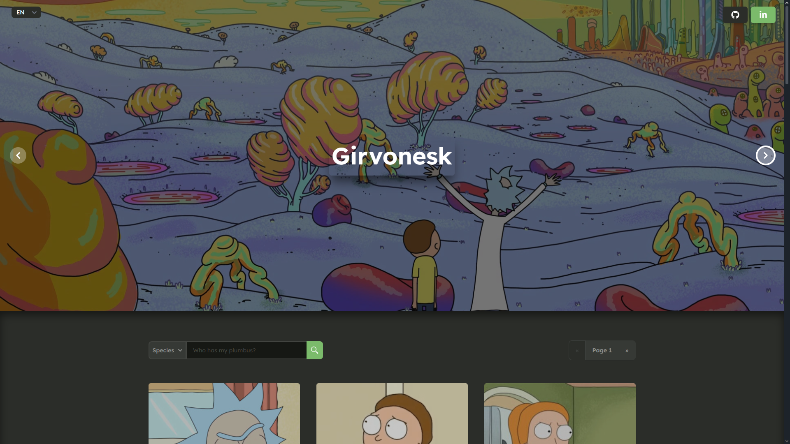
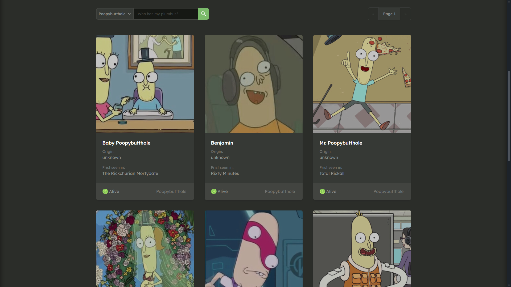
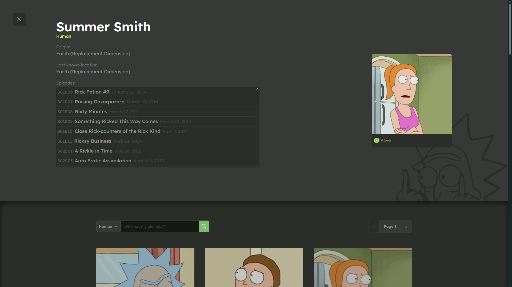
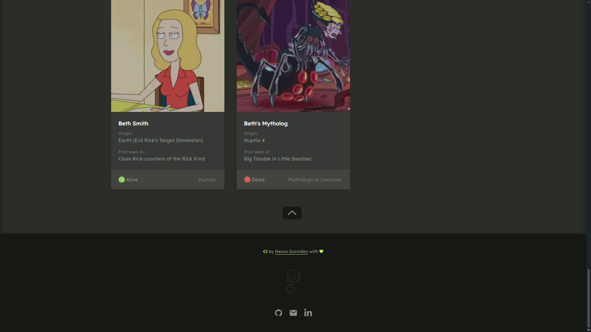

# Ricktionary: A Rick and Morty Encyclopedia [🌌👽](https://ricktionary.vercel.app)

### [English](#english-version) | [Español](#versión-en-español)

## English Version

### 🛠️ Technologies Used:
- **Backend:** Django, PostgreSQL, REST API
- **Frontend:** Angular 16, Tailwind CSS, HTML
- **External API:** [Rick and Morty API](https://rickandmortyapi.com/)

### 📖 Project Description:
**Ricktionary** is a full-stack web application inspired by one of my favorite series: *Rick and Morty*, functioning like a *Pokédex* for fans of the show. It showcases an extensive list of characters, locations, and episodes from the *Rick and Morty* universe. The app includes easy-to-use filters, allowing users to search characters by various criteria like name, status, species, and more.

The project was built as part of a portfolio to demonstrate skills in full-stack development and to provide a high-quality user experience.

### 🖥️ How It Works:
1. **Backend:**
   - A Django backend with PostgreSQL as the database is used to create and manage the web app's custom API. Data is populated using the public [Rick and Morty API](https://rickandmortyapi.com/), processed and stored locally in the PostgreSQL database. 
   - The backend exposes its own API for interaction with the frontend.
   
2. **Frontend:**
   - The frontend is built with Angular 16, which interacts with the Django API. The interface is styled using Tailwind CSS, offering a sleek, modern, and responsive design.
   - Users can view character details, filter by status, species, or other attributes, and seamlessly navigate between different sections.
   
3. **Database:** 
   - PostgreSQL stores the complete dataset retrieved from the public API and ensures fast and reliable query operations for the frontend.

### 🚀 Features:
- **Character Search and Filter:** Users can search and filter characters by name, species, status, and more.
- **Responsive Design:** Built with Tailwind CSS, the web app is fully responsive and adaptable to various screen sizes.
- **Fast and Dynamic Loading:** Thanks to Angular and efficient API requests, the site delivers a smooth experience.

### ⚙️ Installation and Setup:
To run this project locally, follow these steps:

#### Backend Setup:
1. Clone the repository.
2. Navigate to the backend folder and install dependencies.
    ```bash
    pip install -r requirements.txt
    ```
3. Run the database migrations.
    ```bash
    python manage.py migrate
    ```
4. Run the Django development server.
    ```bash
    python manage.py runserver
    ```

#### Frontend Setup:
1. Navigate to the frontend folder and install the Angular dependencies.
    ```bash
    npm install
    ```
2. Run the Angular development server.
    ```bash
    ng serve
    ```

## Website 👀

[Ricktionary](https://ricktionary.vercel.app)

### 📸 Screenshots:


---



---



---



---

## Versión en Español

### 🛠️ Tecnologías Usadas:
- **Backend:** Django, PostgreSQL, API REST
- **Frontend:** Angular 16, Tailwind CSS, HTML
- **API Externa:** [Rick and Morty API](https://rickandmortyapi.com/)

### 📖 Descripción del Proyecto:
**Ricktionary** es una aplicación web full-stack inspirada una de mis series favoritas: *Rick y Morty*, que funciona como una *Pokédex* para los fans de la serie. Muestra una lista extensa de personajes, ubicaciones y episodios del universo de *Rick y Morty*. La web incluye filtros fáciles de usar, lo que permite a los usuarios buscar personajes según varios criterios, como el nombre, estado, especie, entre otros.

El proyecto fue creado como parte de un portafolio para demostrar habilidades en desarrollo full-stack y proporcionar una experiencia de usuario de alta calidad.

### 🖥️ Cómo Funciona:
1. **Backend:**
   - El backend está desarrollado con Django y utiliza PostgreSQL como base de datos. Los datos se rellenan utilizando la API pública [Rick and Morty API](https://rickandmortyapi.com/), procesada y almacenada localmente en la base de datos de PostgreSQL.
   - El backend expone su propia API para interactuar con el frontend.
   
2. **Frontend:**
   - El frontend está desarrollado con Angular 16, que interactúa con la API de Django. La interfaz está diseñada con Tailwind CSS, lo que ofrece un diseño moderno, elegante y adaptable.
   - Los usuarios pueden ver los detalles de los personajes, filtrar por estado, especie u otros atributos y navegar fácilmente entre diferentes secciones.

3. **Base de Datos:** 
   - PostgreSQL almacena el conjunto de datos completo recuperado de la API pública y asegura operaciones de consulta rápidas y confiables para el frontend.

### 🚀 Funcionalidades:
- **Búsqueda y Filtro de Personajes:** Los usuarios pueden buscar y filtrar personajes por nombre, especie, estado, y más.
- **Diseño Responsivo:** Con Tailwind CSS, la aplicación es completamente responsiva y se adapta a diferentes tamaños de pantalla.
- **Carga Rápida y Dinámica:** Gracias a Angular y a las solicitudes eficientes a la API, el sitio ofrece una experiencia fluida.

### ⚙️ Instalación y Configuración:
Para ejecutar este proyecto localmente, sigue estos pasos:

#### Configuración del Backend:
1. Clona el repositorio.
2. Navega a la carpeta del backend e instala las dependencias.
    ```bash
    pip install -r requirements.txt
    ```
3. Ejecuta las migraciones de la base de datos.
    ```bash
    python manage.py migrate
    ```
4. Ejecuta el servidor de desarrollo de Django.
    ```bash
    python manage.py runserver
    ```

#### Configuración del Frontend:
1. Navega a la carpeta del frontend e instala las dependencias de Angular.
    ```bash
    npm install
    ```
2. Ejecuta el servidor de desarrollo de Angular.
    ```bash
    npm start
    ```

## Página Web 👀

[Ricktionary](https://ricktionary.vercel.app)

### 📸 Capturas de Pantalla:


---


---


---

